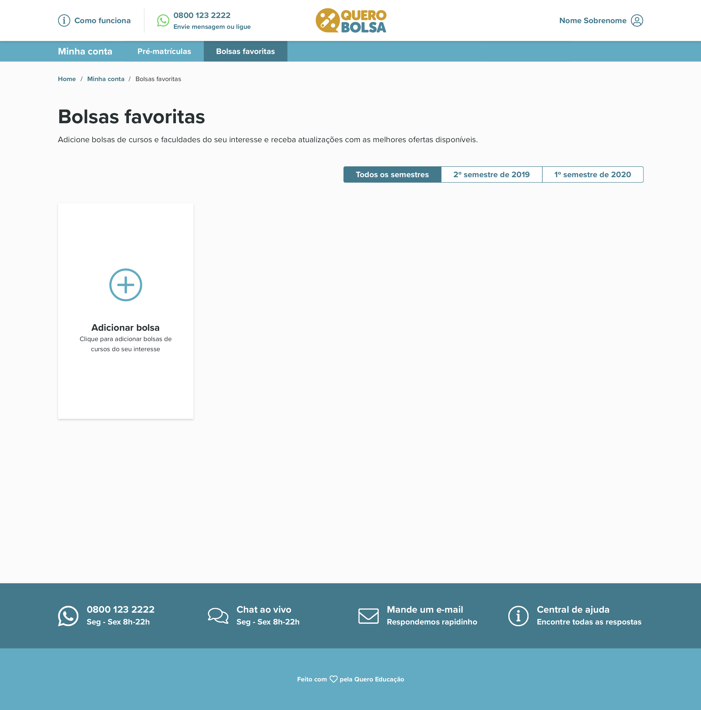

# Teste de Front End da Quero Educação
Criação da landing page de *Bolsas Favoritas* do QueroBolsa.com, uma página onde o aluno pode filtrar bolsas de estudo de seu interesse e adicionar à uma lista de bolsas favoritas.

## Technology
* HTML 5
* CSS 3
* JS (ES6)

## Design
* Responsive layout
* Mobile first

### Prototypes
- <a href="https://drive.google.com/drive/folders/1W-tYS90OG4Jn7QiWQ9pTU6b2U64_PijO">Link do Google Drive com os layouts disponibilizados</a>

### Live demo
- <a href="https://joaresmiranda.github.io/2020-devtest-quero/front-end">Landing page</a>

### Screenshots
- Versão Desktop

- Versão Mobile
